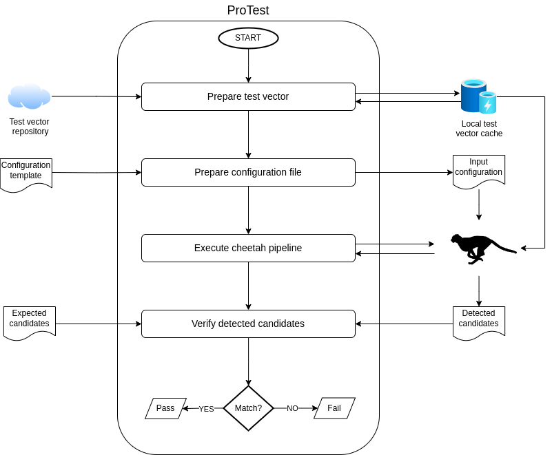

ProTest - the PSS Product Testing Framework
===========================================

The PSS Product testing framework (ProTest) consists of a set of "product" tests, supported by a number of python-based backend applications, for verifying that the Square Kilometre Array's Pulsar Searching Sub-system (PSS) conforms to SKA requirements. 

Pulsar and fast-transient searching is carried out using an application called cheetah (see https://ska-tdt.gitlab.io/cheetah/). Cheetah comprises a number of modules which are added together and configured to form a pipeline. Whilst each of these modules is supported by its own set of unit tests, ProTest's purpose is to execute the pipeline as a whole, and verify that it performs as designed.  In this sense, ProTest considers cheetah to be a "black box".

Cheetah is a command line application which requires a number of command line arguments. ProTest prepares cheetah for execution, ensuring all inputs and command line arguments are available. It then executes cheetah as a child process, in most cases producing a set of candidate detections. ProTest then evaluates these candidates and uses them to determine whether or not cheetah is behaving as designed. 

Examples of command line arguments required by cheetah are as follows. 

* The pipeline type (i.e., what are we searching for? Pulsars or single pulses).
* The data source (e.g., a test vector (filterbank file) or a UDP data stream).
* A configuration. This is usually an XML file which enables/disables and tunes each of cheetah's modules so that they can pieced together to form a pipeline. 

The basic workflow of ProTest is summarised in the following diagram.

.. toctree::
  :maxdepth: 1

  install 
  run
  product
  develop

